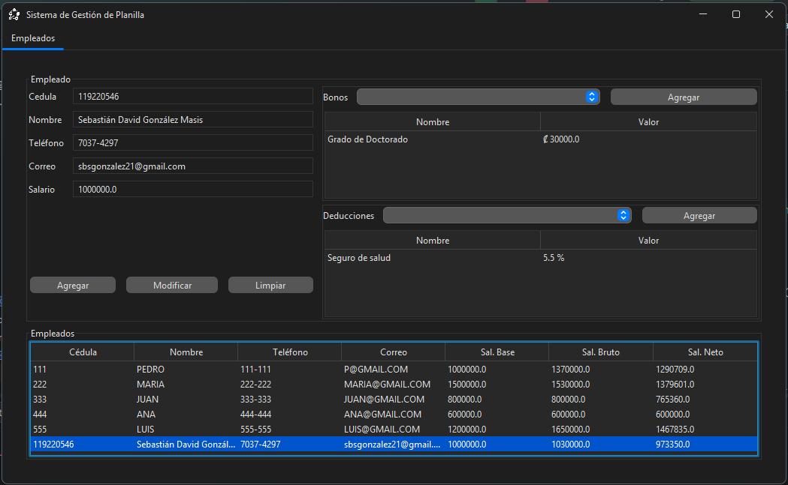
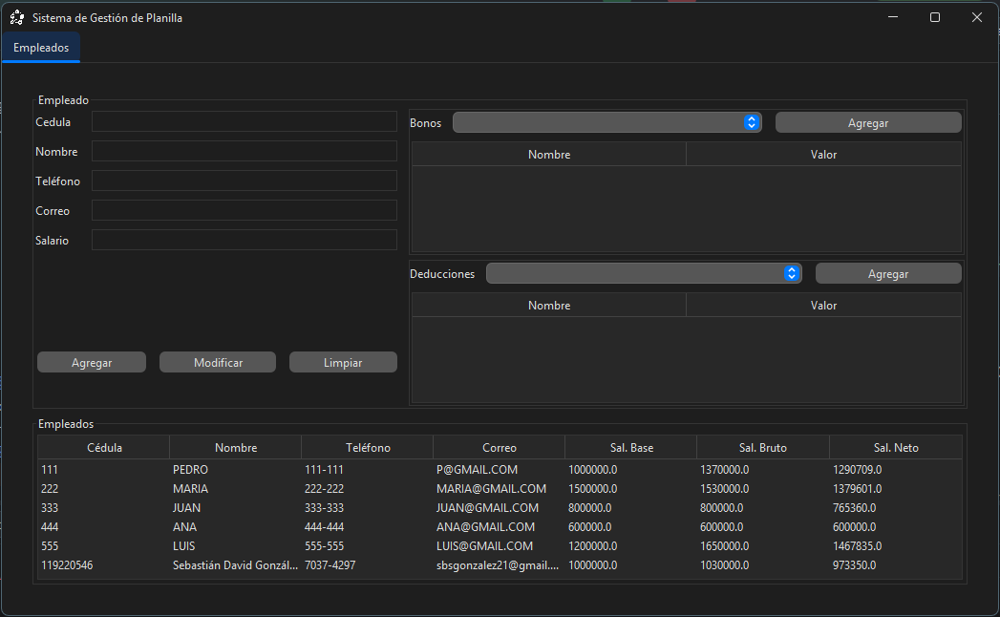

# Sistema de Gestión de Planilla

Desktop app built for **Exam 1** of **Programación III** (2026-02).

It's a small payroll manager: you register employees with a base salary,
attach bonuses and deductions to them from a fixed catalog, and the system
computes gross and net salary automatically. Everything is loaded from
`data.xml` on startup and written back to it when the window closes, using
JAXB.

## Architecture

Three layers, MVC only in the presentation layer (as required by the exam spec):

- `presentation/payroll/` — Swing UI, `PlanillaView` + `Controller` + `Model`,
  plus the table models feeding the three tables in the view (employees,
  assigned bonuses, assigned deductions).
- `logic/` — `Service` (the only entry point the UI talks to) and the domain
  entities (`Empleado`, `Rubro`, `TipoBono`, `TipoDeduccion`).
- `data/` — `Data` (the root object that gets marshalled) and `XmlPersister`,
  a singleton that loads/saves `data.xml`.

`AbstractModel` and `AbstractTableModel` are generic base classes (Observer /
`PropertyChangeSupport` and a generic Swing `TableModel`, respectively) —
not payroll-specific, reused as-is wherever a model or table model is needed.

```
src/main/java/system/
├── Application.java
├── data/
│   ├── Data.java
│   └── XmlPersister.java
├── logic/
│   ├── Service.java
│   └── entities/
│       ├── Empleado.java
│       ├── Rubro.java
│       ├── TipoBono.java
│       ├── TipoDeduccion.java
│       └── utilities/
│           └── TipoValor.java
└── presentation/
    ├── AbstractModel.java
    ├── AbstractTableModel.java
    └── payroll/
        ├── PlanillaView.java
        ├── Controller.java
        ├── Model.java
        ├── EmpleadosTableModel.java
        ├── BonosAsignadosTableModel.java
        └── DeduccionesAsignadasTableModel.java
```

## How bonuses/deductions link to employees

- `Rubro` is an abstract class (`nombre`, `tipoValor`, `valor`) extended by
  `TipoBono` and `TipoDeduccion`. Both live in a fixed catalog inside `Data`
  (`catalogoBonos`, `catalogoDeducciones`) — the exam spec treats these as
  read-only reference data, not something the user creates.
- `Empleado` doesn't store its own copies of the bonuses/deductions it has:
  it holds `List<TipoBono>` / `List<TipoDeduccion>` marked `@XmlIDREF`,
  pointing at the `@XmlID`-tagged `nombre` field on `Rubro`. Same idea for
  `Empleado.cedula`, which is also `@XmlID` and doubles as its natural key —
  there's no separate generated id.
- `Rubro.calcularMonto(salarioReferencia)` applies the rule generically:
  `PORCENTUAL` returns `salarioReferencia * (valor / 100)`, `FIJO` returns
  `valor` as-is. Gross and net salary are plain derived methods on
  `Empleado`, never persisted:
  - `salarioBruto = salarioBase + Σ bono.calcularMonto(salarioBase)`
  - `salarioNeto  = salarioBruto − Σ deduccion.calcularMonto(salarioBruto)`

`data.xml` ships with a seed catalog (3 bonuses, 3 deductions) and six seed
employees so there's something to look at on first run.

## Editing a employee

Selecting a row in the employees table loads that `Empleado` into the edit
form — including its assigned bonuses and deductions, staged separately from
the catalog so they can be changed without touching the catalog itself.
`cédula` is locked once an employee is selected (it's the XML id), so
"Modificar" always updates in place rather than creating a new record.

## Running it

Standard Maven project, entry point is `system.Application`. Run it from
IntelliJ or with `mvn compile exec:java -Dexec.mainClass=system.Application`.
`data.xml` must be present in the project's working directory.

## Screenshots




## Author

Sebastián David González Masis — Programación III, Exam 1 (2026-02)
